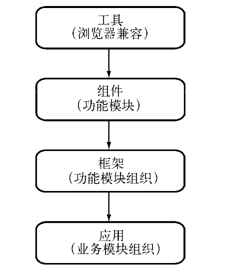

## 背景

JavaScript诞生以来，就被当成页面的小脚本，没有被人们重视。在Web1.0时代，Javascript主要有两方面的用处：表单校验；网页特效。在Web2.0时代，前端工程师使用它给用户带来的更好的体验，在这个过程中，B/S架构比C/S架构表现得更为优越的地方，至此，JavaScript才被广泛重视起来􏱖。

在Web2.0时代，JavaScript主要经历了以下的变迁：

在后天的发展下，Javascript不断的被类聚和抽象，以更好的组织代码，从另一个角度来说，Javascript的不具有模块化的缺点也暴露出来。

JavaScript通过script标签引入代码，对比其他语言看起来就显得杂乱无章，社区也为Javascript提出了规范，其中CommonJs提出的算是具有里程碑的意义

## CommonJs规范

Commonjs为Javascript制定了一个美好的夙愿——让Javascript能在任何地方运行

CommonJs定义的模块规范十分简单，分为以下三点：

+ 模块引用 — require
+ 模块定义 — exports
+ 模块标识 — module

## Node模块实现

Node并未直接按照规范来实现，而是进行了一些取舍，Node在实现模块主要有以下几点：

+ 路径分析
+ 文件定位
+ 编译执行

在Node中，模块分为两类，一类是Node提供的模块，称为核心模块；一类是用户编写的模块，称为文件模块

+ 核心模块在Node源代码的编译过程中，编译进了二进制执行文件。在Node进程启动时，部分核心模块就直接被加载进内存中，所以这部分核心模块引入时，文件定位和编写执行这两部可以省略，并且在路径分析中优先判断，所以它的加载速度时最快的。
+ 文件模块则是在运行时动态加载的，需要完整的路径分析、文件定位、编译执行，速度比核心模块慢。

特点：

+ **优先从缓存加载**
+ **路径分析和文件定位**
+ **模块编译**

## 核心模块

核心模块在编译成可执行文件的过程中，被编译进了二进制文件，核心模块其实分为C/C++编写的和JavaScript编写的两部分，其中C/C++文件存放在Node项目的src目录下，JavaScript文件存放在lib目录下。

+ JavaScript核心模块的编译过程
  + 转存C/C++代码
  + 编译Javascript核心模块
+ C/C++核心模块编译过程
  + 内部模块组织形式
  + 内建模块的导出
+ 核心模块的引入流程
+ 编写核心模块

## 包与NPM

Node组织了自身的核心模块，也使得第三方文件模块可以有序地编写和使用。但是第三方模块中，模块与模块之间不能直接引用。而在模块之外，包和NPM则是将模块联系起来的一种机制。

CommonJs的包规范的定义其实也十分简单，由包结构和包描述文件两个部分租组成，前者用于组织包中的各种组织文件，后者用于描述包的相关信息，以供外部读取分析。

