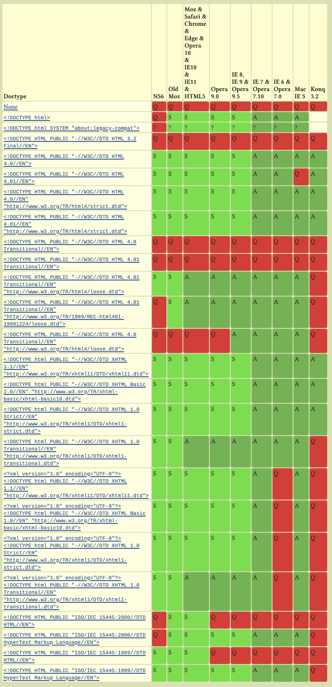

## 前言

前端在日常开发中，一定会写 <!DOCTYPE html> 在我们的html文件最开始的一行，但是他具体有什么用？不加会对页面造成什么影响？HTML5之前的版本是什么样子的？不知道你想过这些问题没有，本文就带着这些疑问，来了解 <!DOCTYPE html>。

## 正文 

在w3school上是这么解释的：<!DOCTYPE>声明不是HTML标签，指示web浏览器关于页面使用哪个HTML版本进行编写的指令；在 HTML 4.01 中，<!DOCTYPE> 声明引用 DTD，因为 HTML 4.01 基于 SGML。DTD 规定了标记语言的规则，这样浏览器才能正确地呈现内容。HTML5 不基于 SGML，所以不需要引用 DTD。

看到这儿，你可能有些疑问，什么是SGML？什么是DTD？

### SGML（Standard Generalized Markup Language）

SGML（Standard Generalized Markup Language，即**标准通用标记语言**）是现时常用的超文本格式的最高层次标准，是可以定义标记语言的元语言，甚至可以定义不必采用< >的常规方式。由于它的复杂，因而难以普及。

同时它也是一个ISO标准："ISO 8879:1986 Information processing -- Text and office systems -- Standard Generalized Markup Language (SGML)"

它有非常强大的适应性，也正是因为同样的原因，导致在小型的应用中难以普及。

[HTML](https://bk.tw.lvfukeji.com/baike-HTML)和[XML](https://bk.tw.lvfukeji.com/baike-XML)同样衍生于它：XML可以被认为是它的一个子集，而HTML是它的一个应用。

XML的产生就是为了简化它，以便用于更加通用的目的，比如[语义Web](https://bk.tw.lvfukeji.com/baike-语义Web)。它已经应用于大量的场合，比较著名的有[XHTML](https://bk.tw.lvfukeji.com/baike-XHTML)、[RSS](https://bk.tw.lvfukeji.com/baike-RSS)、[XML-RPC](https://bk.tw.lvfukeji.com/baike-XML-RPC)和[SOAP](https://bk.tw.lvfukeji.com/baike-SOAP)。

### DTD（Document Type Definition）
DTD（Document Type Definition）即文档类型定义，XML文件的DTD可以看成一个或者多个XML文件的模板，在这里可以定义XML文件中的元素、元素的属性、元素的排列方式、元素包含的内容等等。
DTD概念源于SGML，每一份SGML文件，均应该有相对应的DTD。对XML文件而言，DTD并非特別需要，well-formed XML就不需要有DTD。

## HTML4中如何声明

从上面我们知道，HTML4.01是基于SGML的，所以HTML4.01的声明方式和HTML5的声明方式的区别还是比较大的。

```html
<!DOCTYPE HTML PUBLIC "-//W3C//DTD HTML 4.01 Frameset//EN" 
"http://www.w3.org/TR/html4/frameset.dtd">
```

## HTML5中如何声明

HTML5 不基于 SGML，所以不需要引用 DTD，只需要这样写

```html
<!DOCTYPE html>
```


在HTML5中`<!DOCTYPE html>` 存在的意义在于**阻止浏览器在渲染文档时进入混杂模式(Quirks Mode)**。也就是说`<!DOCTYPE html>`这一文档类型可以确保浏览器**尽可能地**使用遵循规范的模式来渲染，而不是使用某些不符合规范的渲染模式。

**混杂模式和标准模式**

很久很久以前，web 页面主要运行在两类浏览器：网景的 Navigator 和微软的 IE。后来 W3C 制定了 web 规范之后，为了保证现有页面可用，各大浏览器不能立马使用新规范。

于是，浏览器厂商们引入了两种模式来区别对待符合新标准的站点和旧的遗留站点：混杂模式（Quirks Mode）和标准模式（Standards Mode）。在过渡阶段还存在一种接近标准模式（Almost Standards Mode）。

- **混杂模式**，也成为**怪异模式**，会兼容 Navigator 4 和 IE 5 的非标准行为。
- **近标准模式**会兼容少数的混杂行为，可以理解为过渡模式。
- **标准模式**只兼容符合标准描述的行为。

请确保把 DOCTYPE 放在 HTML 文件的顶部。如果有任何其他字符位于 DOCTYPE 之前，比如注释或 XML 声明，会导致 Internet Explorer 9 或更早期的浏览器触发混杂模式。

除了上面这两种声明类型外，HTML还有很多其他声明类型：



## 结束

现在你已经可以回答本文开头的三个问题了，如果不能说明你还得再看一遍，嘿嘿嘿。

参考：

+ [https://hsivonen.fi/doctype/](https://hsivonen.fi/doctype/)
+ [https://juejin.cn/post/6844904119069589517](https://juejin.cn/post/6844904119069589517)