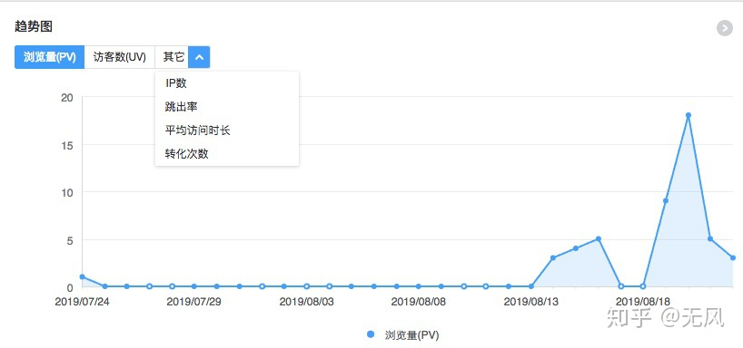
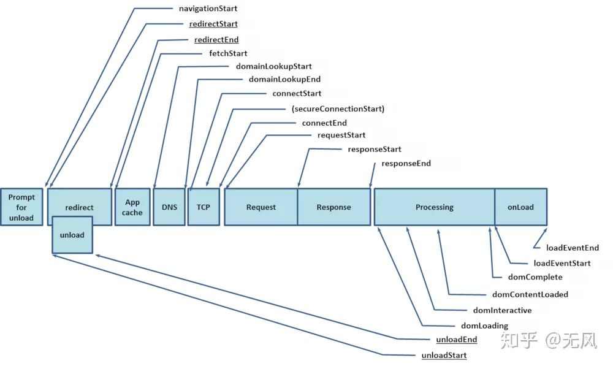

## 应用场景和类型

### 主要场景

什么是前端监控？为什么要使用前端监控？

产品，首先要建立在使用场景上，所以首先讨论下监控使用的几个主要使用场景。纵观当前市面上各个前端监控产品，无外乎是满足两个方面的需求，监察**用户**的使用情况，监察**系统**的运行状态。所以当前也从 用户 和 系统 两个维度来讨论主要的使用场景。

#### 用户使用情况

系统前端直面用户，即是和用户交流的窗口，也是产品运营数据第一手数据收集地，所以这是任何完备版的监控系统都绕不过去的话题。

**pv、uv等运行数据**

运维一个网站，有多少人来访问了，每天访问的人次是多少，这些数据是衡量一个网站运行好坏的晴雨表。当前比较主要的维度列举如下：

- pv： 访问人次，一般每次刷新页面都会 + 1
- uv： 访问人数，每人一天内只计数一次，一般小于等于pv
- ip数：访问的ip数量
- 跳出率：打开一个网页的概率／总的网页访问数
- 平均访问时长：访问总时长 / 访问页数
- 平均访问深度：在当前域名跳转的次数 / 访问次数
- 会话数：用户发起的session的数量
- **路由切换量（rpv）**：由于当前很多较复杂的网站都是采用spa结构，使用传统的pv，uv不能反映用户真实使用状况，所以这个指标就显得非常重要了，一般来说路由切换一次 rpv + 1，最终得到一个路由访问的次数

各个统计网站都根据不同的维度和认知对行为数据进行统计，然后通过时间维度，按（时/天/月）来对网站的运行数据进行分析，得到当前网站的运行状态。

**埋点，点击流**

为了要记录用户在网站上的点击，拖动，跳转等行为，对页面上元素绑定的一些事件并上报记录，称作埋点。有的网站只针对重点操作进行埋点，用作审计和时候追查，而另一些网站做全量事件拦截，对用户的所有行为数据都进行记录。通过埋点，可以知道用户在网站上做了哪些操作，为事后审计和查找问题提供帮助。

点击流，是基于以上的埋点的记录，把一系列事件串起来，形成一个用户操作的链条。

通过点击流和埋点，可以分析用户的使用习惯，找到用户在网站使用上碰到的问题，帮助网站做的更好。比如，在点击购买链接前，如果多数都会点击对比商品的按钮，那么对比按钮的位置就需要得到凸显等等。

**常见回放**

基于埋点和点击流，我们可以做到对用户使用场景的回放和还原，比如用户点击了一些敏感操作按钮，可以帮助用户找到操作失误记录，再比如对于较难复现的bug，可以通过场景回放来重放用户的操作步骤，复现bug。

#### 系统运行情况

除了对用户行为的监看，前端监控和后端监控有很多类似场景，存在很多监控系统运行的场景，据当前收集的资料和对一些系统的调研来看，包含了以下几个主要方面：

**错误感知**

感知前端页面运行时产生的错误，错误包含多个维度，根据不同系统监控程度不同，一般分成：

- 控制台错误： runtime报出的错误，一般会打印在浏览器开发工具的控制台，这样
- 网络错误： 一般包括 http 等与服务器交互产生的请求错误，比如 http response 返回值为4xx，5xx等错误
- 业务系统自定义错误：一般是各系统自己定义的需要上报的业务错误，比如 http 返回 200，但其实接口返回错误码

**耗时统计**

时间，是影响用户网站体验的主要因素之一。所以打开速度、各种响应速度，都成了监控统计的主要项目，对于耗时，一般根据侧重点不同，分成：

- 页面加载耗时：主要是收集由performace.timing对象提供计算出的各种时间实现的，具体时间可以参考下图

  

- 全链路感知

  全链路状态感知，也称作端到端的全链路监控，基本会收集从请求从 web server 到 db 的全生命周期的状态，基本会记录整个请求在处理过程中各个环节的具体耗时等信息。

### 对应场景的监控类型

以上说明了当前了解到的各个监控的使用场景，我的理解，当前监控的类型大致可以分为以下3类：行为监控，异常监控，链路监控。按照之前的场景说明来归纳和对应下。

#### 行为监控

主要负责监控用户的使用情况，比如点击流，pv，uv等指标都属于此类。还有上面提到的场景回放和录屏也可以归到这一类上面。

行为监控一般的展现形式都是图表，同时提供基于时间等维度的对比功能，能够比较直观的看出数据的变化和趋势对比。

#### 异常监控

包括浏览器主动抛出的错误和接口错误的情况，一般来说异常监控会以列表的形式展示收集到的错误信息，可能包括用户 UA，Ip，网络状态，请求url等等信息的展示。

很多异常监控也结合sourcemap来还原错误堆栈和现场，提供快速查找错误的能力。

#### 链路监控

链路监控对应上面全链路感知的场景，一般的展示场景可以参考开发者工具中的timeline类似，可以直观的看出各阶段耗时情况。

## 行为监控的技术实现

