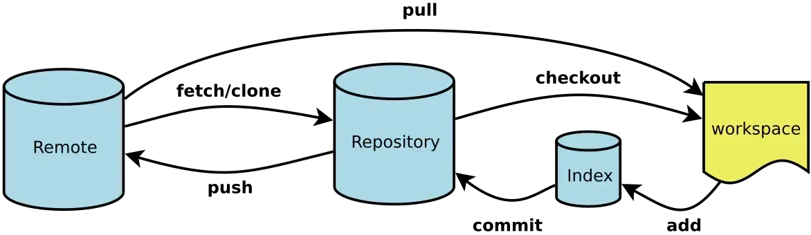
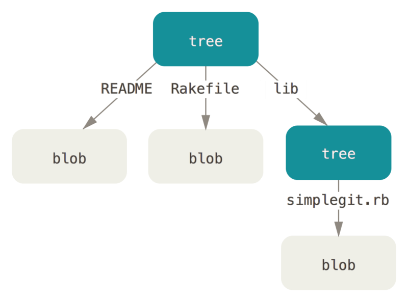
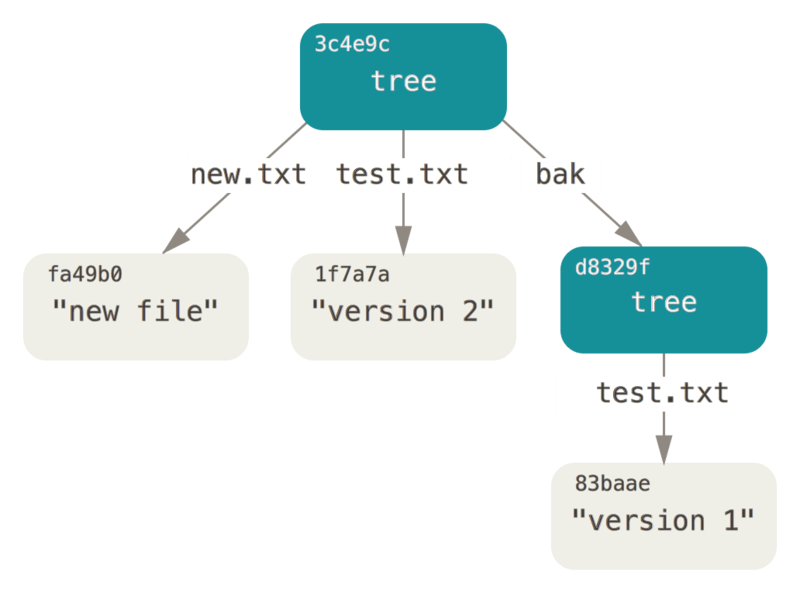
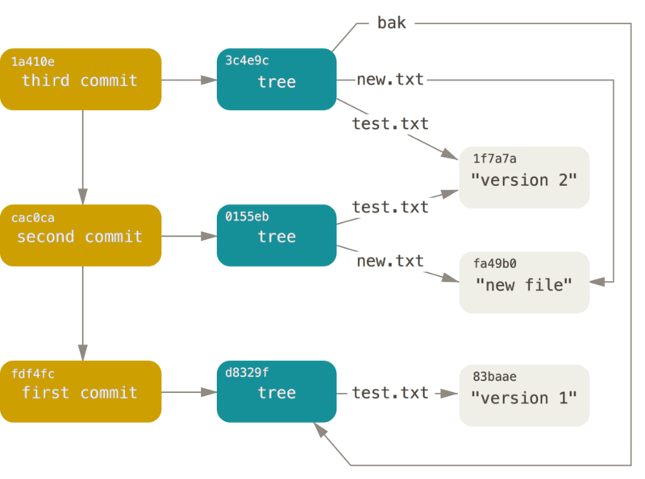

## 一、背景

Git 诞生于2005年，当时 Linux 内核开发者可以免费使用 BitKeeper 作为源码管理工具，但是其作者认为部分开发者对 BitKeeper 进行逆向工程有悖原则，因而收回了使用权限，在这种危机时刻， Linus 再一次将个人英雄主义发挥到了极致，以主导设计开发了 Git 。根据这段背景我们需要意识到这么几个问题:

1. Git 最早用来解决 Linux 内核的开发，因而其功能特点都是面向这种 参与者庞大且分散的协作开发模式设计的，企业的小团队可能体会不到 Git 的真正强大之处 。
2. Git 的设计者和最早的使用者都是 Linux 内核开发者，比起 GUI 界面， 他们更喜欢命令行，更认同 Unix 的设计哲学 ，因而对于习惯了 GUI 界面的开发者(前端、移动端等)Git会显得十分“笨拙”。

## 二、目标

本文目的旨在于学习Git的内部原理，带你了解日常使用的上层命令在Git内部是如何进行运作的。

## 三、行动

### 3.1 plumbing&porcelain

在了解内部原理之前，得先知道什么是上层命令，什么是底层命令。

checkout, branch, remote 等共约 30 个 Git 命令。然而由于 Git 一开始被设计成供 VCS（版本控制系统） 使用的工具集而不是一整套用户友好的 VCS，它还包含了许多底层命令，这些命令用于以 UNIX 风格使用或由脚本调用。这些命令一般被称为 "plumbing" 命令（底层命令），其他的更友好的命令则被称为 "porcelain" 命令（上层命令）。

本文中，主要面对底层命令，底层命令得以让你窥探 Git 内部的工作机制，也有助于说明 Git 是如何完成工作的，以及它为何如此运作。 多数底层命令并不面向最终用户：它们更适合作为新工具的组件和自定义脚本的组成部分。

### 3.2 开始

在正式开始之前，我们需要创建一个新的文件夹，并初始化一个新的仓库，作为演示的例子

```
➜  Desktop mkdir test
➜  Desktop cd test 
➜  test git init
已初始化空的 Git 仓库于 /Users/gouwenkang/Desktop/test/.git/
```

初始化仓库以后，可以看到在文件内会新增一个文件.git，使用tree命令来看看内部的构成：

```
➜  .git git:(master) tree -L 2
.
├── HEAD
├── config
├── description
├── hooks
│   ├── applypatch-msg.sample
│   ├── commit-msg.sample
│   ├── fsmonitor-watchman.sample
│   ├── post-update.sample
│   ├── pre-applypatch.sample
│   ├── pre-commit.sample
│   ├── pre-merge-commit.sample
│   ├── pre-push.sample
│   ├── pre-rebase.sample
│   ├── pre-receive.sample
│   ├── prepare-commit-msg.sample
│   └── update.sample
├── info
│   └── exclude
├── objects
│   ├── info
│   └── pack
└── refs
    ├── heads
    └── tags
```

随着 Git 版本的不同，该目录下可能还会包含其他内容。 

文件

1. **HEAD** : 当前分支
2. **config** : 仓库级的配置信息
3. **description** : 只会被Git的网络程序(如Github)使用，无需关注
4. **index** : 暂存区(staging area)

目录

1. **hooks** : Git Hook 的示例脚本
2. **info/exclude** : 保存了一些你不想在 .gitignore 中配置的忽略文件的信息
3. **objects** : 所有工作目录的内容(content)会以 Git 对象(objects)的形式存放在这个目录
4. **refs** : 存放分支、tag的信息

下面我们通过git的工作流程来一步一步了解git内部是如何进行版本控制的



**① 对工作区修改（或新增）文件**

工作目录下的每一个文件都不外乎这两种状态：已跟踪或未跟踪。 

已跟踪文件是指被上一次快照记录过的文件，这些文件已纳入版本控制，在工作一段时间后， 它们的状态可能是未修改，已修改或已放入暂存区。

**② git add命令执行暂存操作**

当对修改文件执行git add命令时，暂存区的**目录树**将被更新，Git会计算每一个文件的SHA1哈希值，然后作为文件索引存入暂存区。

同时，工作区修改（或新增）的文件快照（Git 使用**数据对象blob**来保存它们）会被保存到Git对象库（.git/objects目录）中，而该对象的ID则对应记录在暂存区的文件索引。

**③ git commit命令提交更新**

在进行提交操作时，Git 会保存一个**提交对象**（指明了顶层树对象和父提交），该提交对象会包含一个指向暂存内容快照的指针。

同时master分支会做相应的更新，指向该提交对象。

## 3.3 Git对象（objects）

所有的对象均可在`./git/objects`中可以查看

#### 3.3.1 数据对象

**创建数据对象**

```
echo "test content"|git hash-object -w --stdin 
```

-w ：选项会指示该命令不要只返回键，还要将该对象写入数据库中。

--stdin ：选项则指示该命令从标准输入读取内容，如果不指定，需要指定需要存储的路径

该命令输出一个长度为 40 个字符的校验和，是一个SHA1哈希值——一个将待存储的数据外加一个头部信息（header）一起做 SHA-1 校验运算而得的校验和。

**查看数据对象**

```
➜  .git git:(master) git cat-file -p  d670460b4b4aece5915caf5c68d12f560a9fe3e4
test content
```

-p ：选项可指示该命令自动判断内容的类型

-t ：指令可以让 Git 告诉我们其内部存储的任何对象类型

**将数据对象的创建与查看作用于文件内容**

```
➜  test git:(master) echo 'version 1' > test.txt
➜  test git:(master) ✗ git hash-object -w test.txt 
83baae61804e65cc73a7201a7252750c76066a30
```

向文件写入新内容

```
➜  test git:(master) ✗ echo "version 2" > test.txt 
➜  test git:(master) ✗ git hash-object -w test.txt 
1f7a7a472abf3dd9643fd615f6da379c4acb3e3a
```

目前在`.git/objects`中加上第一次的test content就有3个数据对象，现在主要是针对文件内容来进行操作，也就是后面两次写入的数据对象。删除本地目录的test.txt 副本，使用`git cat-file`读取version 1的内容再重新写入到test.txt文件

```
➜  objects git:(master) git cat-file -p 83baae61804e65cc73a7201a7252750c76066a30 > test.txt
查看test.txt 可以发现回到了第一次创建的内容
➜  objects git:(master) cat test.txt 
version 1
```

同理，使用第二次返回的SHA1也可以回到第二次更新后的内容

#### 3.3.2 树对象

数据对象只能保存我们的文件内容，不能保存我们的文件名，树对象就能解决这个问题，也允许我们将多个文件组织到一起。

从概念上来讲，Git内部存储的数据结构可以看成这样：



通常，Git 根据某一时刻暂存区（即 index 区域）所表示的状态创建并记录一个对应的树对象， 如此重复便可依次记录（某个时间段内）一系列的树对象。

可以使用 git update-index为一个单独的文件创建一个暂存区

```
git update-index --add --cacheinfo 100644 \
  83baae61804e65cc73a7201a7252750c76066a30 test.txt
```

--add ：因为此前该文件并不在暂存区中（我们甚至都还没来得及创建一个暂存区呢）；

--cacheinfo：因为将要添加的文件位于 Git 数据库中，而不是位于当前目录下。

 同时，需要指定文件模式、SHA-1 与文件名

100644，表明这是一个普通文件；

100755，表示一个可执行文件；

120000，表示一个符号链接；

现在就可以使用 `git write-tree` 将暂存区的内容写入一个树对象

```
➜  test git:(master) ✗ git write-tree
d8329fc1cc938780ffdd9f94e0d364e0ea74f579
➜  test git:(master) ✗ git cat-file -p d8329fc1cc938780ffdd9f94e0d364e0ea74f579
100644 blob 83baae61804e65cc73a7201a7252750c76066a30  test.txt
//也可以使用-t查看
➜  test git:(master) ✗ git cat-file -t d8329fc1cc938780ffdd9f94e0d364e0ea74f579
tree 
//从上面看出，确实是一个树对象
```

现在重新创建一个树对象包括test.txt的第二个版本和一个新文件

```
➜  test git:(master) ✗ echo "new file">new.txt 
➜  test git:(master) ✗ git update-index --add new.txt 
➜  1f git:(master) git update-index --add --cacheinfo 100644 \ 1f7a7a472abf3dd9643fd615f6da379c4acb3e3a test.txt
➜  1f git:(master) git write-tree                                                                      
0155eb4229851634a0f03eb265b69f5a2d56f341
➜  1f git:(master) git cat-file -p 0155eb4229851634a0f03eb265b69f5a2d56f341
100644 blob fa49b077972391ad58037050f2a75f74e3671e92  new.txt
100644 blob 1f7a7a472abf3dd9643fd615f6da379c4acb3e3a  test.txt
```

使用`git read-tree`可以将一个树对象写入缓存。

```
➜  test git:(master) ✗ git read-tree --prefix=bax d8329fc1cc938780ffdd9f94e0d364e0ea74f579

➜  test git:(master) ✗ git write-tree
21796597e851b4eb3a6588aa89a532a6d16b0e46
➜  test git:(master) ✗ git cat-file -p 21796597e851b4eb3a6588aa89a532a6d16b0e46
040000 tree d8329fc1cc938780ffdd9f94e0d364e0ea74f579  bax
100644 blob fa49b077972391ad58037050f2a75f74e3671e92  new.txt
100644 blob 1f7a7a472abf3dd9643fd615f6da379c4acb3e3a  test.txt
```

--prefix：将已知的一个树对象写入缓存，并命名为bax

现在git内部存储的数据结构是下面这样的：



#### 3.3.3 提交对象

现在，我们有了三个树对象，分别代表我们想要跟踪的不同项目快照。 然而问题依旧：若想重用这些快照，你必须记住所有三个 SHA-1 哈希值。 并且，你也完全不知道是谁保存了这些快照，在什么时刻保存的，以及为什么保存这些快照。 而以上这些，正是提交对象（commit object）能为你保存的基本信息。

使用 `git commit ` 能够创建一个提交对象。为此需要指定一个树对象的 SHA-1 值，以及该提交的父提交对象（如果有的话）。使用第一次创建的树对象：

```
echo 'first commit' | git commit-tree d8329f
➜  test git:(master) ✗ git cat-file -t 4c8e48af67966f4bc3bf01fd366ff140f5df3a56
commit //可以看到，成功得提交了一个提交对象
➜  test git:(master) ✗ git cat-file -p 4c8e48af67966f4bc3bf01fd366ff140f5df3a56
tree d8329fc1cc938780ffdd9f94e0d364e0ea74f579
author gouwenkang <gouwenkang@meituan.com> 1606816103 +0800
committer gouwenkang <gouwenkang@meituan.com> 1606816103 +0800

first commit
//查看提交对象里面的内容包含：树对象、name、email、时间戳、提交注释
```

接着，另外创建两个提交对象，分别引用各自的上一个提交

```
➜  test git:(master) ✗ echo "second commit" | git commit-tree 0155eb  -p 4c8e48a
54d8f8b726a6ea3dfd8ad6536e4fd8df202c5745
➜  test git:(master) ✗ echo "thrid commit"|git commit-tree 21796597e851b4eb3a6588aa89a532a6d16b0e46 -p 54d8f8b726a6ea3dfd8ad6536e4fd8df202c5745
03b0fc6da77022dfc3b52c59a9d036e15e2d8c5d
```

现在使用git log命令来查看，可以发现，已经真实存在了git提交历史记录。

```
git log --stat 03b0fc

commit 03b0fc6da77022dfc3b52c59a9d036e15e2d8c5d
Author: gouwenkang <gouwenkang@meituan.com>
Date:   Tue Dec 1 18:55:11 2020 +0800

    thrid commit

 bax/test.txt | 1 +
 1 file changed, 1 insertion(+)

commit 54d8f8b726a6ea3dfd8ad6536e4fd8df202c5745
Author: gouwenkang <gouwenkang@meituan.com>
Date:   Tue Dec 1 17:55:31 2020 +0800

    second commit

 new.txt  | 1 +
 test.txt | 2 +-
 2 files changed, 2 insertions(+), 1 deletion(-)

commit 4c8e48af67966f4bc3bf01fd366ff140f5df3a56
Author: gouwenkang <gouwenkang@meituan.com>
Date:   Tue Dec 1 17:48:23 2020 +0800

    first commit

 test.txt | 1 +
 1 file changed, 1 insertion(+)
```

上面的所有流程就是我们平时经常使用的上层命令，`git add`和`git commit`的底层运行流程了，Git 所做的工作实质就是将被改写的文件保存为数据对象， 更新暂存区，记录树对象，最后创建一个指明了顶层树对象和父提交的提交对象。 这三种主要的 Git 对象——数据对象、树对象、提交对象——最初均以单独文件的形式保存在 `.git/objects `目录下。

可以得到下面的流程对象图：



### 3.4 Git引用（refs）

#### 3.4.1 创建分支底层命令

完成上面的步骤，我们在本地我们已经通过底层命令完成了上层命令，`git add` 和` git commit` 的操作，现在我们在master分支已经有了3次提交记录，可以使用git log 来进行查看

```
➜  test1 git:(master) git log --pretty=oneline master

992231cadebad7d4bdc38e74b22828bf99fcdf06 (HEAD -> master) thrid
c076cb2bac5db55e7dfecd417541c494efe250f8 (test) second
e37f7d017bee544ac548916985bcc929dbe90b6a first
```

那么如何创建一个新的分支呢？这就需要借助到git的引用机制在.git/refs的文件中可以看到这个过程：

```
➜  test1 git:(master) find .git/refs
.git/refs
.git/refs/heads
.git/refs/heads/master
.git/refs/tags
```

用一个自定义的名称去引用一次提交，也就是我们常说的分支，例如上面这个例子，我想新建一个分支，只需要新建一个名称，用它指向第二次提交，我就能在这个分支上面拿到他之前的提交历史记录，那么我们如何将这个名称去指定到具体的提交呢？这就需要用到底层命令git update：

```
git update-ref refs/heads/test c076cb2bac5db55e7dfecd417541c494efe250f8 //让test指向第二次的提交
```

现在，在`./git/refs/head/`文件中，就有了两个文件，分别是master和test，现在我们可以通过git branch 去查看分支：

```
➜  test1 git:(master) git branch

* master
  test
(END)
```

可以看到，新增了一个test的分支，这就是我们上层命令，` git branch <branch> `，在 ` git branch <branch> ` 实际运行中，会取得当前所在分支最新提交对应的 SHA-1 值，并将其加入我们想要创建的任何新引用中。

#### 3.4.2 HEAD引用

上面我们留下了一个问题，在运行`git branch <branch>` 时，会获取最新提交的SHA-1值，那么git内部是如何获取最新的值呢？答案是HEAD引用，可以在`.git/head` 文件中看到，可以查看里面的内容：

```
➜  .git git:(master) cat HEAD
ref: refs/heads/master
```

发现他指向当前的分支，当我们使用`git checkout test`时，他会重新指向新的分支。

```
➜  test1 git:(master) git checkout test  
切换到分支 'test'
➜  test1 git:(test) cat .git/HEAD 
ref: refs/heads/test
```

发现了这一点，我们还是没有解决git是如何获取最新的SHA-1值，实际上，我们在执行`git commit`的时候该命令会创建一个提交对象，并用 HEAD 文件中那个引用所指向的 SHA-1 值设置其父提交字段，这样就获取到了最新的SHA-1的值。

上面我们都是通过cat 去查看的HEAD的向，实际上这种方式不怎么安全，我们可以使用底层命令` git symbolic-ref` 去获取到HEAD的指向

```
➜  test1 git:(test) git symbolic-ref HEAD
refs/heads/test
```

我们也可以通过这个命令来编辑他的指向从而做到切换分支的作用：

```
➜  test1 git:(test) git symbolic-ref HEAD refs/heads/master
➜  test1 git:(master) ✗ 
```

#### 3.4.3 远程引用

上面介绍了2针对于本地分支的两种引用类型，分别是创建分支和切换，如何结合远程分支在`.git/refs`内还有一个对应的远程引用（remote），现在可能还没有远程引用，原因是因为你还没有建立，现在建立一个新的远程连接：

```
➜  test1 git:(master) ✗ git remote add origin git@github.com:Gouwenkang/test.git //连接远程分支创建origin别名
➜  refs git:(master) git push origin master:master //将本地的marter分支推向远程的master分支，注意：如果远程没有master分支会自动创建
```

现在看.git/refs文件内，就会新增一个文件remote，这就是远程引用

```
➜  remotes git:(master) cd ..
➜  refs git:(master) ls
heads   remotes tags
//进去看看，就能发现里面有一个我们命名的别名，进去就会发现远程的master分支引用的对应提交对象
➜  remotes git:(master) cd origin 
➜  origin git:(master) cat master 
212693bc8873d4f4ee0b12e2368daee871f321b7
➜  origin git:(master) git cat-file -t 212693bc8873d4f4ee0b12e2368daee871f321b7
commit
```

还有一种引用叫做标签引用，有兴趣可以自己去 [git-scm](https://git-scm.com/book/zh/v2/Git-内部原理-Git-引用) 上看看

## 四、总结

完成上面这些步骤，你已经完成了git的主要流程，也应该相当了解 Git 在背后都做了些什么工作，并且在一定程度上也知道了 Git 是如何实现的。 上面讨论了很多底层命令，这些命令比高层命令来得更原始，也更简洁。 从底层了解 Git 的工作原理有助于更好地理解 Git 在内部是如何运作的，也方便你能够针对特定的工作流写出自己的工具和脚本。

## 五、未来规划

1. 针对于Git的原理，基于git写出适合团队的管理工具