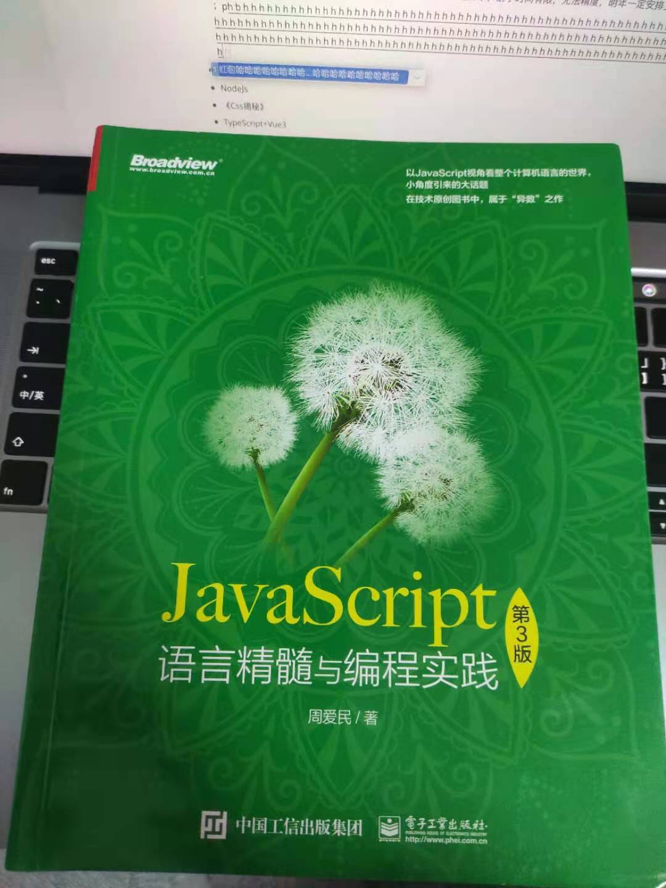
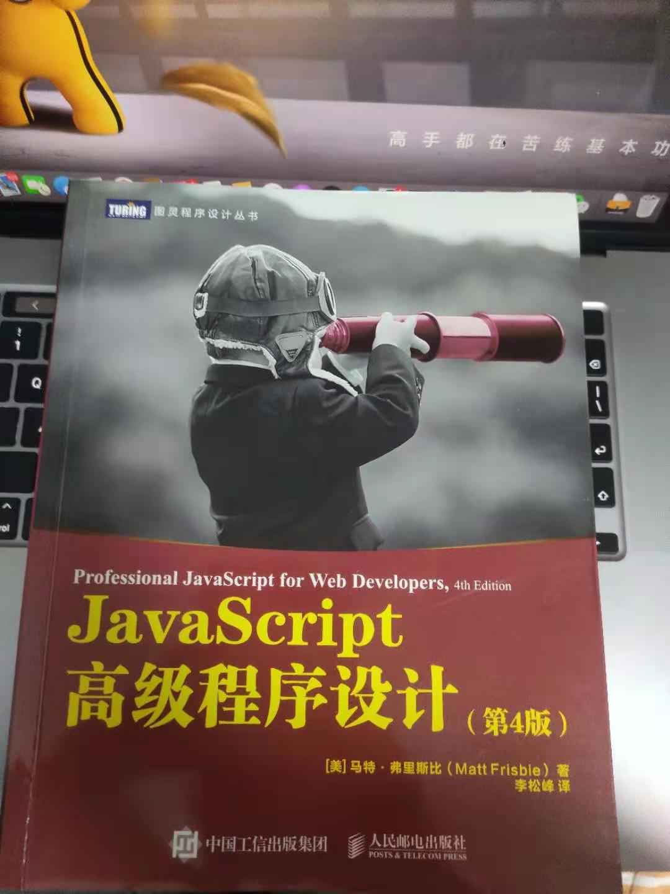
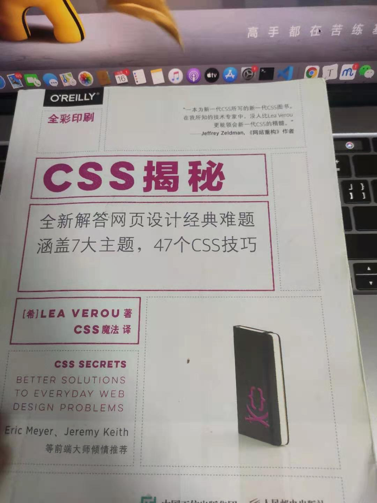

转眼间2020年也接近了尾声，回首自己这一年的经历，从一方面来讲真是颇为曲折；从另一方面来讲，但也比较顺利，最终的结果是好的。

今年也算得上是自己人生轨迹的一个转折点吧，无论从校招拿到美团offer，还是正式成为一名中共党员，对我来说具有里程碑的意义。

## 一切的起点

我对自己的定义就是一个普通人，一个稍微比较努力的普通人，对于我个人而言，我觉得我能达到今天的成就，90%离不开我20年的努力以及那10%的运气。

在2020年之前，我是属于无论怎么努力却也怎么也达不到很大成就的人，因为家庭的原因，自己出生于一个农村家庭，父母可能没有城里边人的意识，当时的家庭经济状况也不支持我去城里面读书。最后通过自己的努力，在成都的一个双非院校就读，可能对比与其他985、211优秀的同学来说，就光从学历这一点来说我就差了一大截吧，不过我也没有因此而产生自卑，从大一开始就怀着一身踌躇满志，就确定了自己的大学一定要努力，自己在大学期间也获得了各种各样的奖参加各种各样的活动，也结识了自己的对象，嘻嘻嘻～对我来说也算是比较丰富的大学生活吧。

从今年年初春招，我还没有找工作的意识，因为其他的一些原因，导致无法分心去找春招实习，后面在秋招的时候真的特别后悔，对于我这个双非院校的学生来说，没有大厂实习经历，真的是寸步难行，不过也还好我大学经历比较丰富，BAT，TMD这类公司都给了我面试。

从5月份开始，认识的好多同学都去大厂进行实习，这个时候我才开始后知后觉有找工作的意识，不过这个时候好多公司的春招也已经结束了，当时也就投了5、6家的样子，因为经历的原因，虽然 `网易`、`学而思` 给了我面试机会，最后也没有通过，不过也非常庆幸自己能够在这种公司进行面试，也在很大程度上对当时的自己打了警钟，必须得从改变自己的想法，不要把自己当成一个学生。

因为自己是一个双非院校的学生，后面秋招的情况，也是惨不忍睹的，不过好在结果是好的。

## 抓住机遇

因为今年疫情的原因，很多公司都是线上面试，因此对于公司来说招聘成本也降低了，从而简历门槛也降低了，对我来说，这是个可遇不可求的机遇，因此我在秋招那段时间，疯狂投递简历，然后也面试了很多公司，最后也拿到了心满意足的offer。可以这么说，疫情限制了我，也成就了我。当然在秋招期间，离不开对象、朋友、家人的照顾，以及很多企业面试官的指导，我从内心是真的感谢每一位面试官和帮助过我的人。

## 时刻紧张，不能懈怠

在拿到美团offer后，休息了一段时间，后面觉得自己不能因为拿到offer就放松自己，自己和其他优秀的人的差距还是存在，于是我又开始了自己的学习之路，后面感觉自己的学习达到了一个瓶颈，无论怎么学，对自己都没有太大的提升，于是我毅然决然得来到了北京，来到了美团，提前进行实习。

来到北京第一天，就感觉北京这个城市对我充满了挑战，我自己也对自己未来的工作生活充满了期待，在美团实习20天了，无论是从我的心态还是能力都有很大的提升，接触到了很多之前没有接触过的生活状态、技术、同事。从第一天报道，到今天，我自身也有非常大的转变，也非常感谢我的mentor和 [和伟哥](https://www.recoluan.com/) 感谢他们对我的生活上，技术上的关心和指导，真的非常感谢，是用言语无法表达的那种感谢。

## 告别过去，拥抱未来

mentor给我说过一句话：**保持空杯心态，从不停止在不同发展时期向不同层面的最佳学习的行动，是从心态到行动帮助我们持续迭代自己、少走弯路，更快成功的有效武器。** 是mentor的这句话真正的点醒了我，不能因为自己在短时间取得成就，而放松自己。自己的目光不要局限于自己眼前，要将自己的眼光放长放远，才能达到自己的 “天花板”。

2020年即将成为过去式，未来还很长远，告别过去拥抱未来。

## 来年计划

+ 《Javascript语言精髓》— 之前在秋招的时候就拜读过一点周老师书，耐于时间有限，无法精度，明年一定安排上。

  

+ 第四版《Javascript高级程序设计》— 第三版的红宝书刷了2遍，感觉针的很不戳，第四版出来也好几个月了，明年也得安排上

  

+ NodeJs — NodeJs一直是我的一个短板，没有经过系统的学习，随着接触技术得越来越多，愈发感觉到无力，所以明年也得安排上

+ 《Css揭秘》 — 刷了1遍多，这本书真的写得很好，明年再继续精读一遍，写一篇读书分享

  

+ TypeScript+Vue3 — 最近在美团实习，有个项目用的就Vue3+TSX，明年正式入职之前，必须安排上

+ 运营 blog&github — 作为一个训练时长2年半的Coder，发现自己的blog & github 还像一个小白，明年也开始运营起来

+ webpack打包原理

+ 每周3道leetcode&codepen — 之前给自己订了计划每天各一道，后面坚持了2个月左右，感觉真的很难，降低一下要求，一周各三道不过分吧。

