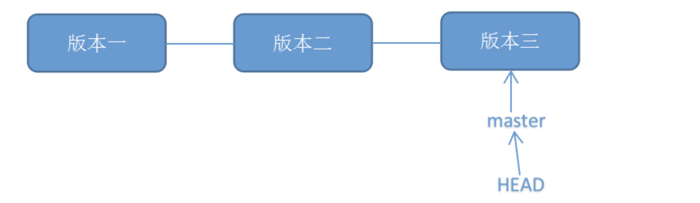
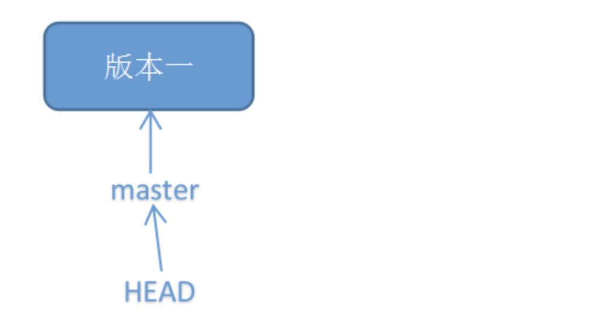
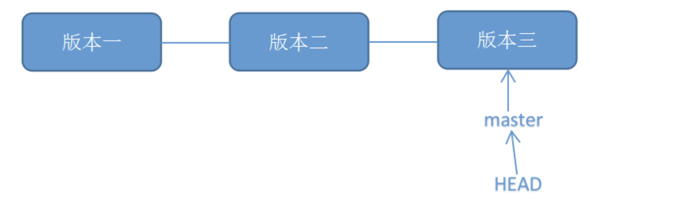
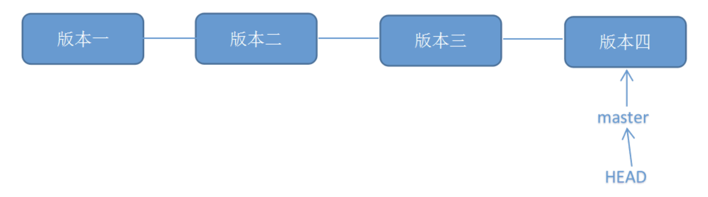

> 用于记录工作中遇到的问题

+ 如果从具体的远程分支feature拉取新的分支featureA **Done**
  
  + git checkout -b featureA origin/feature
  
+ 从远程分支feature拉取新分支在本地featureA进行开发，如何合并远程分支 **Done**
  + git checkout feature
  + git merge featureA
  + git pull origin feature
  + git push origin feature
  
+ merge和rebase的区别  **Done**

+ vscode的 option+shift+f 格式化代码是跟根据什么来格式的  **Done**

+ Git stash **will Do**

  场景：当同时做多个需求时，当前需求正在开发，但是另一个需求突然有点问题需要修改，就可以使用git stash 来将当前这个分支的工作区保存下来，再切换到另一个需要紧急修复的分支，完成修复后，再通过git stash pop 回到之前修改的内容。

+ git撤销上次提交 **will Do**

  git reset sha-1
  
  将本次提交与上次提交合并可以使用 --amend
  
+ git reset

  `git reset --hard sha-1`

   git reset的作用是修改HEAD的位置，即将HEAD指向的位置改变为之前存在的某个版本，如下图所示，假设我们要回退到版本一：

  

  

  如果我们版本一之后的版本不需要了，就可以使用这个reset

+ git revert

   git revert是用于“反做”某一个版本，以达到撤销该版本的修改的目的。比如，我们commit了三个版本（版本一、版本二、 版本三），突然发现版本二不行（如：有bug），想要撤销版本二，但又不想影响撤销版本三的提交，就可以用 git revert 命令来反做版本二，生成新的版本四，这个版本四里会保留版本三的东西，但撤销了版本二的东西。

  `git revert -n sha-1`

  

  

  

+ 解决分支冲突

### Todo

**短阶段**

+ 浏览器原理
+ typescript
+ vue3
+ DOM元素原型链
+ vite
+ npm原理-互相引用
+ babel
+ jsx解析流程
+ postCss
+ leran
+ serveless
+ WebAssembly
+ Web Worker
+ Service Worker
+ 单页面打包&多页面打包
+ 自动化构建 & 部署

**长阶段**

1. Node
2. CSS
3. JS

