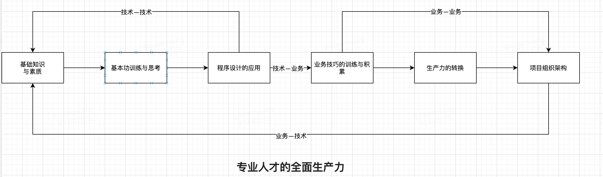

磊哥说：“我理解的现在的前端是浮躁的，层出不穷的新技术，应接不暇的新特性，让前端开发者倍感焦虑。” 在解读这句话之前，首先思考这样一个问题：为什么会出现新技术？为什么会出现新特性？

## **为什么会出现新技术？**

新技术的出现，肯定有它出现的原因，我大致总结为一下几点：

- 解决现目前存在的无法解决的问题
- 弥补现目前技术的痛点
- 提高前端开发者的效率
- 提高用户的体验

## **为什么会出现新特性？**

用JS来说，随着技术的不断发展，现目前的一些语法可能无法满足我们的开发需求，为了解决这种问题，开发者可能就需要额外花费时间。这无疑增加了我们的开发负担，JS的设计者在每年就会征集开发者的需求，通过开发者的反馈，不断向JS添砖加瓦，添加一些新的特性。例如：Promise、async、await之类的特性。

## **当今前端现状**

通过上面的分析，无论是新技术还是新特性，无疑都是将前端带向一个好的方向发展，可是为什么会是浮躁的呢？

前端是一个知识串联性相当强的一门技术体系，实际上，每一门技术都是从0到1的养成过程，这样才能串联起所有知识，然后通过训练转化生产力。在还没有将前端知识架构体系串联之前，就想着学习新技术，新特性。甚至不知道它是做什么用的，在自己的知识架构体系中占的什么位置，就胡乱得开始学。毋庸置疑，学完后，可能在短时间内带来了惊叹和恍然大悟，但是放在长时间上来看，这就是在浪费时间。但是在当前的前端圈中，80%人都是这样，无法将自己的知识架构体系串联起来，自认为自己已经入门，其实不然，殊不知自己还在山脚徘徊。

## **感慨**

什么样的技术水平决定了应该学习什么样的知识与技术，什么样的知识与技术水平决定了到什么样的公司，到什么样的公司决定了在什么样社会层次，什么样的社会层次决定了眼界与发展的高度。

人生要健壮，事业就需要健壮，技术的健壮是事业发展的基石。如果认为自己努力了，但是没有得到自己想要的，那就想想自己是不是真的踏踏实实的努力了，临时抱佛脚、浮躁不安的努力与真正踏实努力的结果是完全不同、天壤之别的。真正的认识自己，认识自己的努力，认识自己的知识技术水平，做出一个学术派知识分子应该有的学习态度，踏踏实实从0到1的学习才是职业生涯中成功的唯一途径。

## **如何在当今前端圈中站稳脚步**

上面提到一个词：“串联”，我理解的串联是从0到1，不断向后发展，不要急于求成，前面0-1的转变还没完成，就想着串联后面，这是浮躁的表现。

我认为对于个人发展而言，需要满足四个串联：

技术—技术

技术—业务

业务—业务

业务—技术

前面说的前端发展现状，是要满足技术的串联，完成技术的知识架构体系达到闭环。但是对于大部分人而言，纯有技术串联是不行，毕竟像尤雨溪这样的人是少数，大部分的人学习技术，还是为了满足业务需求。

技术到技术的串联是一个坎，那么技术到业务的串联也是一个坎。

对于的技术与技术可以形成知识架构体系，业务与业务也能形成一个架构体系。

最后业务—技术整个完成串联，形成一个完整的知识架构体系。

这就是我理解的专业人才的全面生产力。