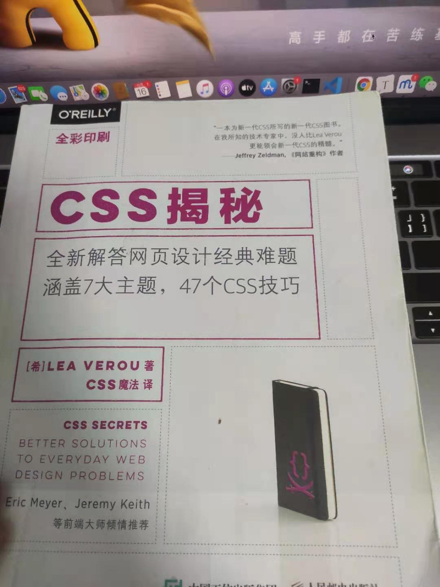

### 前言

来到美团，我就被这里的技术实力和影响力深深折服，我十分庆幸自己能够有机会在这里进行实习，到目前虽然只有一个月，但对于我个人而言，在这里实习一个月，学习到了之前半年才能学习到的知识。

来到美团实习之前，我也明确了自己此次来的目的：

+ 学习为主，体验大公司的技术氛围
+ 提前了解公司的工作流程
+ 适应从学生到 “打工人” 的转变
+ 挣点零花钱 （最后发现挣的都用了，也剩不下几个钱了）

### 实习过程中暴露的问题&个人成长

#### 技术方面

+ 在来美团前，因为之前接触到的项目也不会设计到很多人协同开发的场景，也不会有联调、灰度这种规范化的流程。打个比方，来到美团前我就像是一个「野战军」，来到美团通过训练，我变成了一个「正规军」。例如 **Git** ，刚来1周的时候mentor让我好好学 git ，我当时心想，不就是git嘛，` git add` 、`git commit` 、`git push`  一把梭，这有什么的。后面磊哥还让我学习git的原理，我当场就打脑壳，心想这玩意儿又用不上，学着有啥用。然后咬咬牙，既然是磊哥给的任务，必须完成。抱着这种心态，我终于把git的原理搞懂了，但是后面正式接需求的时候，什么 `master` 、`feature` 、`release` 各种各样的场景，让我眼花缭乱，遇到问题然后再进行查询文档。直到后来，发现大组里面3个团队，都有被git折磨的时候，才发现磊哥让我深挖git也不是没有道理。现在我才明白，其实磊哥在让我学习git原理这件事上的用心良苦，一句话概括，授人以鱼不如授人以渔，回想起来，在梳理git原理的过程中，磊哥也教会我很多学习和梳理的方法，以至于后面的工作中就像 “如鱼得水” 。
+ 自己之前写的项目，对比与团队的项目，从结构化的层次上来讲相差得很多，因为组内的项目实在是太大了，在接到一个新的需求时，找到具体的代码位置都有点难，例如一个页面对应一个入口文件，在 `lib` 里面还会有着对应页面到一些 `config` ，对应的在 `components` 内还有许许多多业务组件。

#### 沟通方面

+ 在开始的时候，在与其他人进行沟通时，不能很快得 get 到对方的点，增加了沟通负担，不过后面对公司的流程愈发熟悉以后，这种问题也慢慢减少了。

#### 写作方面

+ 来到美团，让我感受最深的就是，写文档太难了～在上学的时候很少像现在这样写文档，自己的写作方面受到了磊哥多方面的吐槽，不过真的写得很烂，来年计划+1：锻炼写作能力

### 自己发现的闪光点

> 虽然自己很菜，但还不至于一无是处，有次觉得自己一无是处时，伟哥的一句话点醒了我：既然你能毕业就来到美团，而且还作为一个双非学生，那么你身上肯定有着不一样的优点。要学着自己发现自己的闪光点，虽然自己的闪光点微不足道。

+ 敢拼敢搏，无论遇到什么困难和挑战，总会想着用尽各种方法去解决
+ 自我感觉学习能力还可以，经过指点还是能很快上手
+ 自我感觉还是比较主动的去承担需求，对工作认真负责

### 总结

来到美团一个月学习到了各方面的知识，也十分庆幸自己选择来体验这种生活，来到美团不代表结束，而是代表新的开始。用磊哥指导的一句话来讲：**保持空杯心态，从不停止在不同发展时期向不同层面的最佳学习的行动，是从心态到行动帮助我们持续迭代自己、少走弯路，更快成功的有效武器。**

**最后的最后：**

现在也12月中旬了，离2021年也只有半个月了，磊哥对我说过一句话：要提前指定好自己下一个阶段的计划，这阶段可能是一个大的阶段，可能1年、5年、10年，也可能是短时间小的阶段，1周、2周，对于个人而言，做事一定要有计划，将计划划分为四象限，下面就附上我在2021年的计划：

+ 《Javascript语言精髓》— 之前在秋招的时候就拜读过一点周老师书，耐于时间有限，无法精度，明年一定安排上。

  

+ 第四版《Javascript高级程序设计》— 第三版的红宝书刷了2遍，感觉针的很不戳，第四版出来也好几个月了，明年也得安排上

  

+ NodeJs — NodeJs一直是我的一个短板，没有经过系统的学习，随着接触技术得越来越多，愈发感觉到无力，所以明年也得安排上

+ 《Css揭秘》 — 刷了1遍多，这本书真的写得很好，明年再继续精读一遍，写一篇读书分享

  

+ TypeScript+Vue3 — 最近在美团实习，有个项目用的就Vue3+TSX，明年正式入职之前，必须安排上

+ 运营 blog&github — 作为一个训练时长2年半的Coder，发现自己的blog & github 还像一个小白，明年也开始运营起来

+ 每周3道leetcode&codepen — 之前给自己订了计划每天各一道，后面坚持了2个月左右，感觉真的很难，降低一下要求，一周各三道不过分吧。