## 一、版本控制

### 1、本地版本控制

**RCS:** 工作原理基本上就是保存并管理文件补丁（patch）。文件补丁是一种特定格式的文本文件，记录着对应文件修订前后的内容变化。所以，根据每次修订后的补丁，rcs 可以通过不断打补丁，计算出各个版本的文件内容。

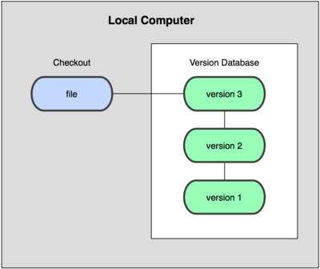

### 2、集中式版本控制系统

**CVS，Subversion** 等：有一个单一的集中管理的服务器，保存所有文件的修订版本。需要协同工作的人们都是通过客户端连到这台服务器，取出最新的文件或者提交更新。

缺点：中央服务器的单点故障、有丢失所有历史更新记录的风险、恢复数据困难

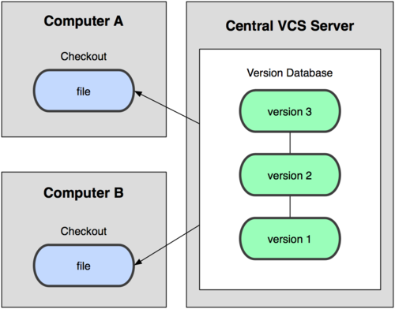

### 3、分布式版本控制

**Git，Bazaar** 等：客户端并不只提取最新版本的文件快照，而是把代码仓库完整地镜像下来。

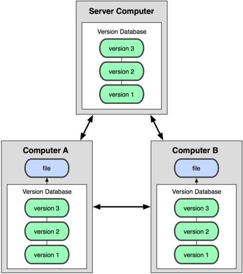

## 二、初始Git

### 1、Git的由来

1991－2002年：在当时Linux 内核开源项目有着为数众广的参与者。绝大多数的 Linux 内核维护工作都花在了提交补丁和保存归档的繁琐事务上。

2002年：项目组开始启用分布式版本控制系统 BitKeeper 来管理和维护代码。2005年：BitKeeper不在免费为项目组提供服务，迫使Linux开源社区开发属于自己的版本控制系统。设计的目标包括：速度、 简单的设计、对非线性开发模式的强力支持、完全分布式、支持大规模项目的开发。

### 2、Git的特点

+ 直接记录快照，不比较差异
+ 近乎所有操作都在本地执行
+ 保持数据都完整性

## 三、Git的文件状态和工作状态

### 1、工作区域

Git本地工作区域分为三个：工作区域、暂存区域、本地仓库

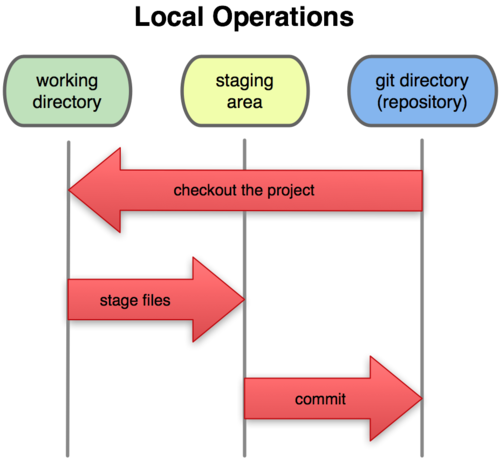

**本地仓库（.git目录）:** 每个项目都有一个 **.git**目录，它是 Git 用来保存元数据和对象数据库的地方，在执行 `git init ` 的时候生成 。clone仓库时实际上就是，clone此目录中的数据。

**工作目录：** 从项目中取出某个版本的所有文件和目录，用以开始后续工作的叫做工具目录。

**暂存区域：** 是一个文件，放在 **.git** 目录中。也被称为索引文件。

### 2、文件状态

对于任何一个文件，当他未被放入git目录之前，处于未跟踪状态（untracted）。

文件在Git内只有三种状态：已修改（modified）,已暂存（staged）和已提交（committed）。

文件在不同状态下所处于的工作区域不同，可以根据文件所处的位置来判断文件当前所处的状态。

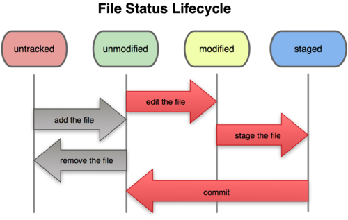

### 3、与文件状态相关的git基本命令

1. `git status`：检查当前所有文件的状态。

   注⚠️【参数扩展】：

    `git status --ignored`：查看ignored文件的状态

   `git status --long` ：使用简洁的方式查看状态

2. `git add` ：将目标文件快照放入暂存区域

   注⚠️【常用】：

   `git add .`：一般是放入所有

3. `git commit` ：提交到本地仓库

   注⚠️【常用】：

   `git commit -m ""`：直接输入提交信息

   注⚠️【参数扩展】：

   `git commit -amend`：撤销提交到commit，重新提交

4. `git reset` + `git checkout`：撤销操作

   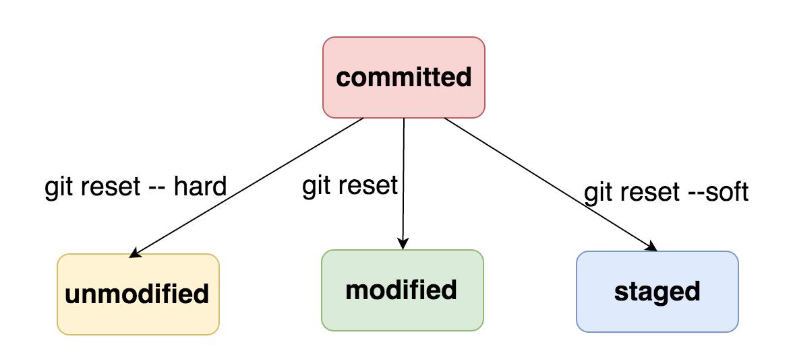

   1. `git reset`：撤销已经暂存到文件，回到modifed状态
   2. `git checkout -- <file>` : 撤销对文件的修改

5. `git diff`：查看两次提交之间的差别，反映到工作区域，即可以查看不同区域之间的差别

   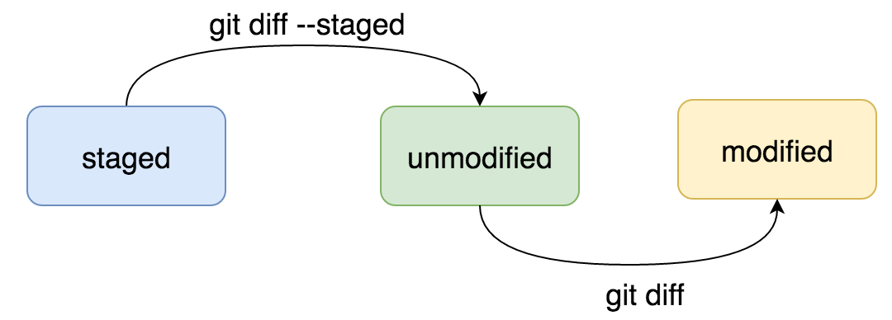

## 四、Git分支

### 1、commit对象在仓库中的数据结构

git保存的是文件的快照。所以在 Git 中提交时，会保存一个提交（commit）对象。该对象包含一个指向暂存内容快照的指针，本次提交的作者信息，包含零个或多个指向该提交对象的父对象指针。

当使用 `git commit` 新建一个提交对象前，Git 会先计算每一个子目录（本例中就是项目根目录）的校验和，然后在 Git 仓库中将这些目录保存为树（tree）对象。

1. 单个提交对象在仓库中的数据结构

   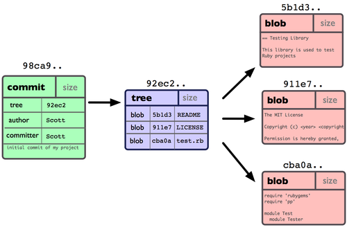

2. 多个提交对象之间的链接关系

   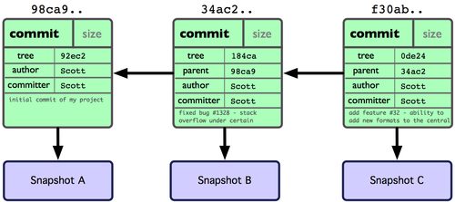

### 2、分支的创建、切换

使用 `git branch <name>`  来创建一个新的分支

那么，Git 是如何知道你当前在哪个分支上工作的呢？保存着一个名为HEAD的指针，它是一个指向你正在工作中的本地分支的指针。

使用`git branch`命令只是创建分支，并没有切换分支。

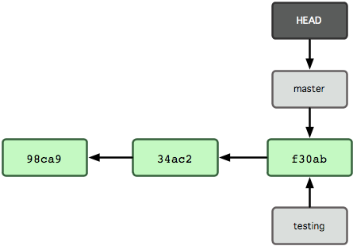

### 3、分支是什么

Git 中的分支实际上仅是一个包含所指对象校验和（40 个字符长度 SHA-1 字串）的文件。

**优点：**

- 创建和销毁一个分支开销低。相当于向一个文件中写入41个字节。
- 速度快，可以在几毫秒的时间内完成分支的创建与切换。与项目复杂度无关。
- 由于保存着祖先信息，所以合并分支的工作很容易。

### 4、与远程分支的交互

一次 Git 克隆会建立你自己的本地分支 master 和远程分支 origin/master，并且将它们都指向 `origin` 上的 `master` 分支。

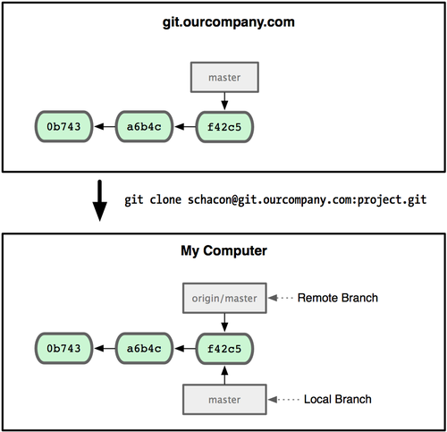

随着开发的进行，远程分支和本地分支会朝着不同的方向发展。

可以使用`git fetch origin`命令来同步远程服务器上的数据到本地，同时将remote索引`origin/master`指针一到它最新的位置上。

`git fetch origin //origin代表远程服务器`

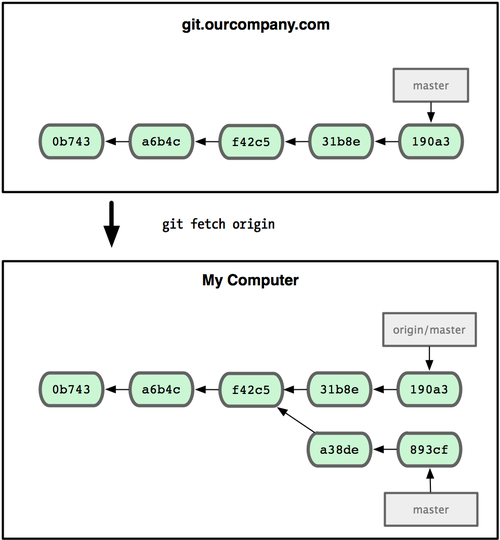

这时使用`git merge origin/master`把该远程分支的内容合并到当前分支：

`git merge origin/master `

上述两个命令可以使用git pull 一条命令来完成

`git pull origin/master `

通过`git push`命令可以，将本地分支推送至远程仓库，或者删除远程分支

`git push origin testing:testing //将本地分支推送至远程仓库
git push origin :testing //删除远程分支`

## 五、Git操作命令

### 1、查看提交历史 git log

`git log`：查看提交历史

注⚠️【参数扩展】：

`git log --graph //可以看到开头多出一些 ASCII 字符串表示的简单图形，形象地展示了每个提交所在的分支及其分化衍合情况
gitk //git log命令的可视化版本，输入命令后会启动一个界面`

### 2、push到远程仓库之后的撤销操作git revert

revert命令是放弃指定提交的修改，但是会生成一次新的提交，需要填写提交注释，以前的历史记录都在；

而**reset**是指将HEAD指针指到指定提交，历史记录中不会出现放弃的提交记录。

git revert 可以用于回滚远程仓库

### 3、储存命令 git stash

开发过程中会遇到这样的情景，当你正在进行项目中某一部分的工作，里面的东西处于一个比较杂乱的状态，而你想转到其他分支上进行一些工作。问题是，你不想提交进行了一半的工作，否则以后你无法回到这个工作点。可以使用git stash命令来储藏当前的工作状态。

储藏可以获取你工作目录的中间状态——也就是你修改过的被追踪的文件和暂存的变更——并将它保存到一个未完结变更的堆栈中，随时可以重新应用。

### 4、git merge 和 git rebase

**git merge：** 你可以用"pull"命令把"origin"分支上的修改拉下来并且和你的修改合并，产生一个新的commit，git提交历史如下。

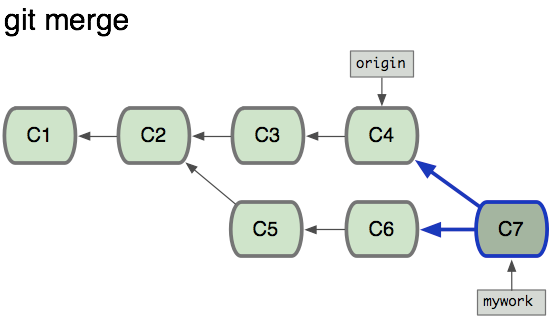

**git rebase**：命令会把你的"mywork"分支里的每个提交(commit)取消掉，并且把它们临时 保存为补丁(patch)(这些补丁放到".git/rebase"目录中),然后把"mywork"分支更新 到最新的"origin"分支，最后把保存的这些补丁应用到"mywork"分支上，改写了“mywork”分支的提交历史。

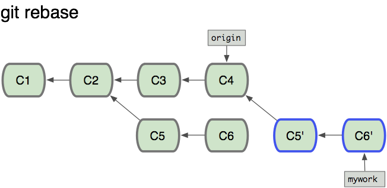

## 六、公司分支管理规范

> 在美团实习的时候，组里面使用git的一些地方还有点不是很规范，并且也存在一些问题，于是乎mentor让我整理一下业内的分支管理规范供参考。

### 1、主要分支：生命周期长，都存在中心库

- master分支：线上发布分支，每次上线前都要创建Tag；
- develop分支：开发主干分支，新feature时从develop分支创建新的feature分支，新feature开发自测完成后合并到develop分支。可用于集成来自针对master分支的hotfix。

### 2、辅助分支：**生命周期十分有限，完成使命后即可被清除。（一般存在开发者那里）**

- feature分支：起源于develop分支，最终也会归于develop分支，通常命名为feature-*。每个大的feature从develop分支建立单独的feature分支，开发测试完成后合并到develop分支，并将feature分支删除。

- - 常用于开发一个独立的新功能，且其最终的结局必然只有两个，其一是合并入develop分支，其二是被抛弃。
  - 最典型的Feature分支一定是存在于团队开发者那里，而不应该是“中心版本库”中。
- release分支(可选)：起源于develop分支，最终归于develop或master分支，通常命名为release-XX。
  - Release分支通常负责“短期的发布前准备工作”、“小bug的修复工作”、“版本号等元信息的准备工作”。与此同时，develop分支又可以承接下一个新功能的开发工作了。
  - Release分支产生新提交的最好时机是develop分支已经基本到达预期的状态，至少希望新功能已经完全从feature分支合并到develop分支了。
  - 在一段短时间内，在release分支上，我们可以继续修复bug。在此阶段，严禁新功能的并入，新功能应该是被合并到develop分支的。经过若干bug修复后，release分支上的代码已经达到可发布状态，此时，需要完成三个动作：第一是将release 分支合并到master分支，第二是一定要为master上的这个新提交打TAG（记录里程碑），第三是要将release分支合并回develop分支。
  - 团队规模不大时，可不启用release分支。
- hotfix分支：用于运维及线上问题修复。源于master，归于develop或master，通常命名为hotfix-*。
  - 当线上出现bug需要修复时, 从master分支创建hotfix分支。
  - 设立hotfix分支的原因是，希望避免“develop分支”新功能的开发必须为BUG修复让路的情况。
  - BUG修复后，需要将hotfix分支合并回master分支，同时也需要合并回develop分支。并将此hotfix分支删除

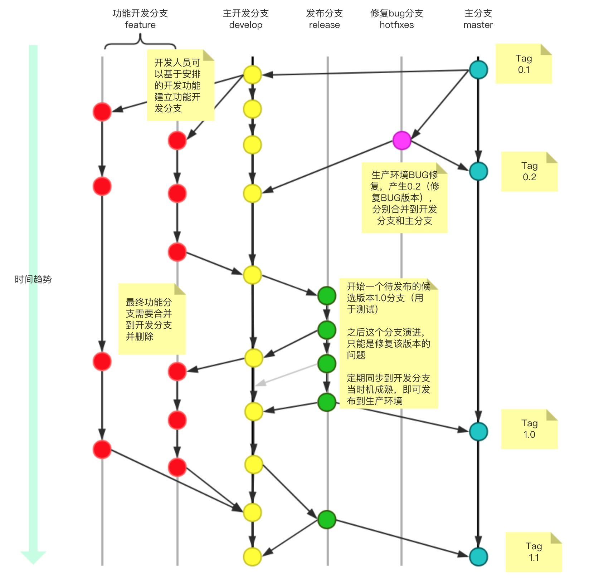

## 七、操作流程总结

1. 创建本地仓库
   `git init`

2. 链接本地仓库与远程仓库

   `git remote add origin`

   //origin默认是远端仓库别名 url 可以是可以使用https或者ssh的方式新建

   `git remote -v`

   // 查看链接的远程仓库

3. 检查配置信息

   `git config --list`

4. Git user name 与email

   ` git config --global user.name "yourname" `

   ` git config --global user.email "your_email" ` 

5. 生成SSH密钥

   `ssh-keygen -t rsa -C "这里换上你的邮箱"`

   `cd ~/.ssh 里面有一个文件名为id_rsa.pub,把里面的内容复制到git库`

6. 远程仓库重新命名

   `git remote rename old new`

7. 提交到暂存区

   `git add .`

8. 提交到本地仓库

   `git commit -m ""`

9. 提交到远程仓库

   `git push <远程主机名> <本地分支名>:<远程分支名>`

10. 查看分支

    `git branch` //本地分支

    `git branch -a ` // 远程分支

11. 创建分支

    `git branch xxx`

12. 切换分支（也可切换远程分支）

    `git checkout xxx`

13. 创建分支并切换

    `git checkout -b xxx`

14. 删除分支

    `git branch -d xxx`

15. 删除远程分支

    `git push -d :xxx`

## 忽略文件

```git
# 此行为注释 会被Git忽略

# 忽略 node_modules/ 目录下所有的文件
node_modules


# 忽略所有.vscode结尾的文件
.vscode

# 忽略所有.md结尾的文件
*.md

# 但README.md 除外
!README.md

# 会忽略 doc/something.txt 但不会忽略doc/images/arch.txt
doc/*.txt

# 忽略 doc/ 目录下所有扩展名为txt文件

doc/**/*.txt
```

